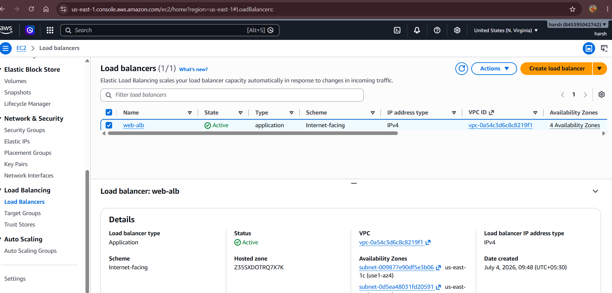
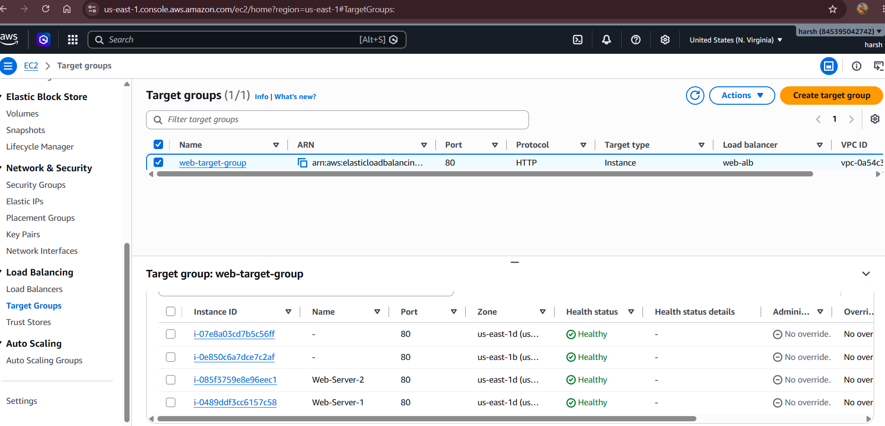
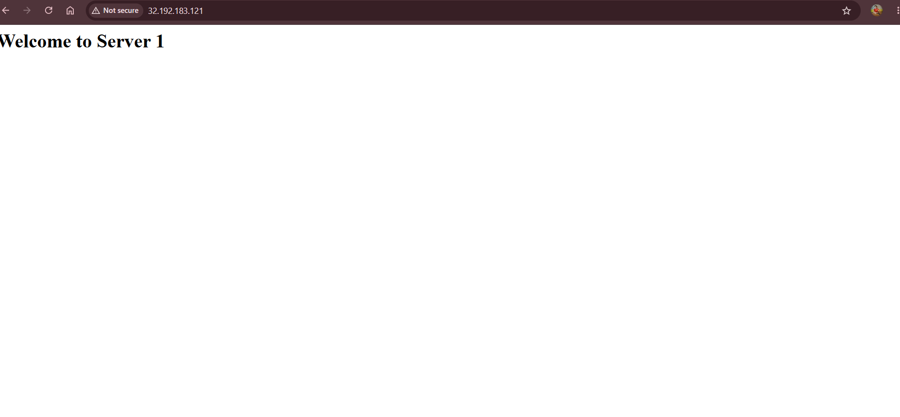
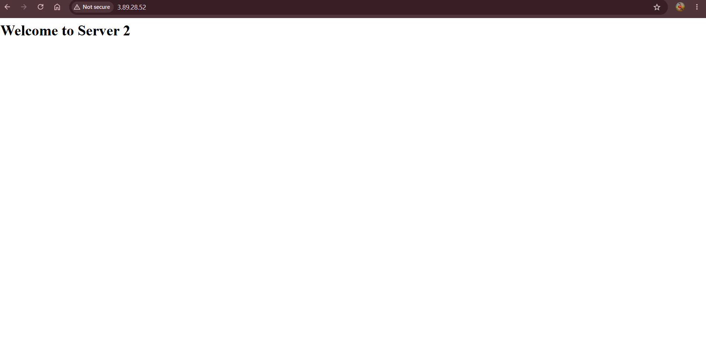

# AWS Application Load Balancer Project

## 📌 Project Overview
This project demonstrates how to deploy multiple EC2 web servers behind an AWS Application Load Balancer (ALB) with a Target Group and Auto Scaling Group.

## 🛠 AWS Services Used
- Amazon EC2
- Application Load Balancer (ALB)
- Target Group
- Auto Scaling Group (ASG)
- Security Groups
- Ubuntu Server
- Nginx

## 🏗 Architecture

User
↓
Application Load Balancer
↓
Target Group
↓
EC2 Instances (Web Server 1, Web Server 2, ...)

## ✨ Features
- Multiple EC2 web servers
- Nginx web server
- Health checks
- Traffic distribution
- Auto Scaling
- High Availability

## 📷 Screenshots
Screenshots are available in the `screenshots` folder.
## 📸 Project Screenshots

### EC2 Instances

### Load Balancer

### Target Group

### Web Server 1

### Web Server 2

## 👨‍💻 Author
Harsh Pratap Singh
